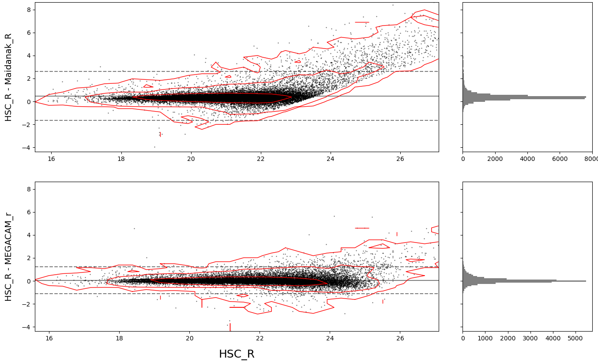

 Photometric Comparison Tools

This repository contains Python scripts to plot figures that are presented in [Ho et al. 2021, MNRAS](https://academic.oup.com/mnras/article/502/1/140/6122898?login=false). The visualizations include scatter plots, confidence contours, and histograms for residual analysis, as well as filter transmission curves.

## Features

- Compare photometry from two datasets and plot the 2D histogram-based contours with confience levels of the distribution
- WCS-FITS image mosaics with source overlays in different bands
- Plot filter transmission/response curves

## Example plots
  
  
  

## Citation
Please cite [Ho et al. 2021, MNRAS](https://academic.oup.com/mnras/article/502/1/140/6122898?login=false) if you use the code in your paper.
